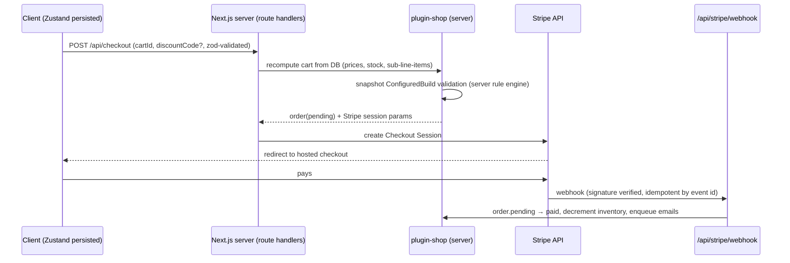
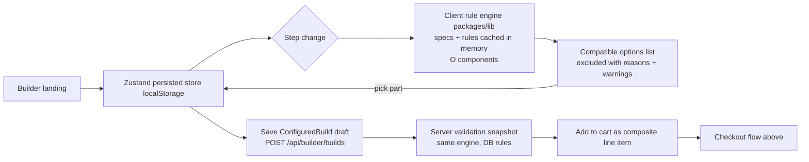

# 02 · Architecture

## Monorepo layout (pnpm workspaces + Turborepo)

```
buildmyrig/
├── apps/
│   └── web/                      # Next.js 15 storefront + Payload config + /admin
├── packages/
│   ├── payload/                  # payload config assembly, shared collection defs, globals, access utils
│   ├── plugin-shop/              # shop plugin (cart, orders, pricing, inventory, discounts)
│   ├── plugin-pc-builder/        # PC builder plugin (builder collections + admin rule manager)
│   ├── ui/                       # shadcn/ui components + Tailwind 4 tokens
│   └── lib/                      # PURE logic: rule engine, pricing, validation, power calc
├── turbo.json
└── pnpm-workspace.yaml
```

Dependency direction (enforced by eslint `import/no-restricted-paths`):

```
apps/web ──▶ packages/payload ──▶ plugin-shop (meets plugin-pc-builder only via integration points)
apps/web ──▶ packages/ui ──▶ Tailwind tokens
plugin-shop ──▶ packages/lib (pricing)          plugin-pc-builder ──▶ packages/lib (rule engine)
plugin-shop ✗ does NOT depend on plugin-pc-builder or Stripe
plugin-pc-builder ✗ does NOT depend on plugin-shop or Stripe
```

`packages/lib` depends on nothing. Plugins depend on `packages/lib` + `payload` types only.

## Plugin boundaries

A Payload plugin is `(pluginOptions) => (incomingConfig: Config) => Config`; plugins add collections/globals/endpoints/admin components by spreading the incoming config, per https://payloadcms.com/docs/plugins/build-your-own.

- `plugin-shop(options)`: injects/inherits ecommerce collections (products, variants, carts, orders, transactions, addresses), pricing + inventory hooks, discount logic, order lifecycle endpoints. Payment-adapter pattern: a payment adapter is injected as an option, so the plugin never imports Stripe directly.
- `plugin-pc-builder(options)`: injects ComponentCategory, Component, CompatibilityRule, DerivedPowerRule, BuildTemplate, ConfiguredBuild; admin custom views (rule manager grid + CSV import, per-component conflict field); REST endpoints for rule evaluation. Receives the shop's product/variant slugs as options — a soft reference via `CollectionSlug` (https://payloadcms.com/docs/typescript/overview#type-helpers), not an import.
- Integration point: `plugin-shop` exposes a **line-item extension registry**. `plugin-pc-builder` calls `registerLineItemType('configured-build', {...})` at config time. The builder plugin never imports cart code; the shop plugin never imports builder code.

## Checkout data flow



Trust rule: the client never computes a price used by the server. Server recomputes from current DB prices at checkout; `ConfiguredBuild.priceSnapshot` is display-only.

## Configurator data flow



Rule data strategy: rules + typed specs loaded once per server boot (`onInit` + cached payload.find, invalidated on rule save via cache tag), sent to the client as a compact JSON index at builder page load (≤ ~300KB at 5,000 components).

## Next.js render boundary

Storefront pages are React Server Components by default; client components only for the configurator, cart drawer, filter sidebar, and animated parts. Payload Local API is used for all server-side data access inside `apps/web` (no HTTP round trip); REST endpoints exist only for external/webhook/client convenience.
