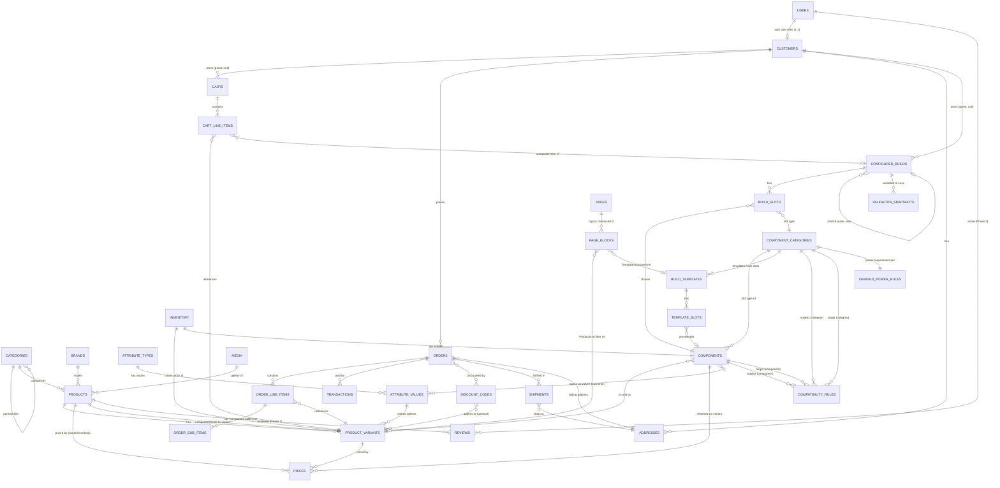

# 03 · Full ERD

Mermaid `erDiagram` covering shop (§3) and PC-builder (§4) domains. Slug-named entities = Payload collections.

Notes

- `USERS` is Payload's auth collection; `CUSTOMERS` is a 1:1 extension doc (shop data) referencing a user. Assumption A3.
- Multi-entity-priced `PRICES` (product-level, variant-level, component-inherited) resolved via a single resolution hook; see [04-collections/pricing-inventory.md](04-collections/pricing-inventory.md).
- `VALIDATION_SNAPSHOTS` is a sub-structure on ConfiguredBuild, not a separate collection (drawn as one for clarity).
- Rule bidirectionality (CPU↔motherboard) is two rule docs or a `bidirectional` flag on one doc — see [04-collections/compatibility.md](04-collections/compatibility.md).
